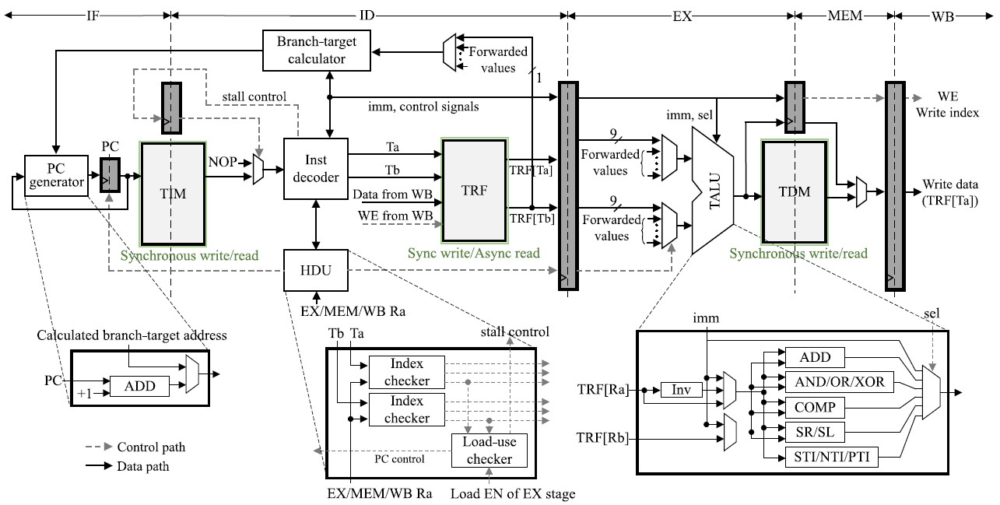

# Design and Evaluation Frameworks for Advanced RISC-based Ternary Processor
SystemVerilog implementation of the paper:

> *Design and Evaluation Frameworks for Advanced RISC-based Ternary Processor*

## Overview

This project provides a SystemVerilog implementation of the advanced RISC-based ternary processor presented in the paper "Design and Evaluation Frameworks for Advanced RISC-based Ternary Processor." It serves as an RTL platform for simulation and evaluation of balanced ternary processor architectures.

## Features

- SystemVerilog RTL implementation
- Balanced ternary processor architecture
- Custom ternary instruction set
- Ternary register file and instruction memory
- Modular and simulation-ready design

## Architecture

<p align="center">
  
</p>

## Repository Structure

```
.
├── rtl/                    # RTL source files
|
├── tb/                     # Testbench
|    └── Testbench.sv
|
└── README.md
```

## Simulation

Run the SystemVerilog simulation using your preferred simulator.

## Requirements

- A SystemVerilog simulator

## Reference

If you use this project, please cite the original paper:

> *Design and Evaluation Frameworks for Advanced RISC-based Ternary Processor*
